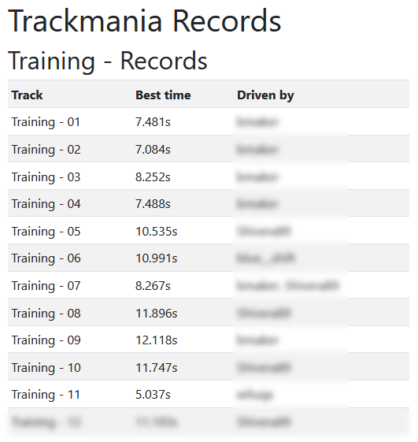
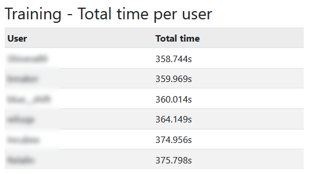
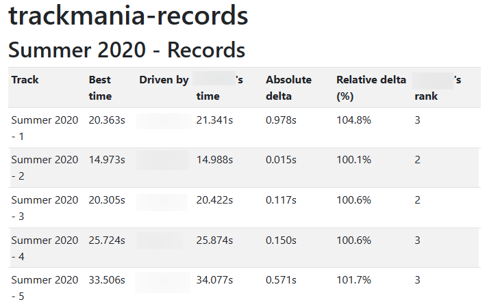

# trackmania-records

This project allows you to compare your Trackmania 2020 records with your friends.

In the browser, it looks like this:

It also features a total time comparison:

Advanced statistics for a certain user can be displayed by appending `?user=name` to the URL (address in your browser):

## Setup

### 1. Install web application (server)

Please refer to: https://github.com/rsnitsch/trackmania-records/tree/develop/server

### 2. Install uploader (client)

The uploader is what extracts your trackmania records from the autosaved replay files on
your computer and sends them to the web application.

The installation and usage instructions for the upload tool can be found at the bottom of
the web application index page. Alternatively, you can look them up here:
https://github.com/rsnitsch/trackmania-records/tree/develop/client
